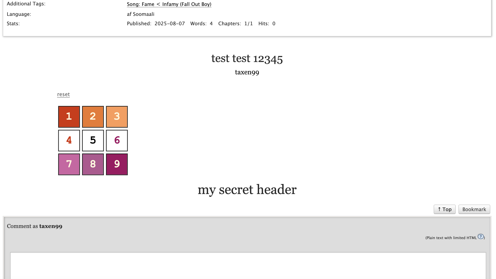

# what is this?
A tool for generating a pure html/css keypad compatible with https://archiveofourown.org/ that hides content from the user until they enter a certain passcode.

</img>
</img>

<!-- 
 -->

# why is this?
Fun.

# how is this?
Run the `generate_keypad` crate to generate an `index.html` and `style.css` file in the `output` directory, used for local testing. Then, either manually port the styles to ao3's bespoke workskin format and copy the contents of the html body tag into a work, or use the the two provided transform crates with the appropriate file paths to automagically get something that is ready to be copy-pasted into ao3.

The `generate_keypad` crate takes two parameters:
1. A passcode made out of a string of numbers (1-9). May be at most four digits long, but due to limitations and me not being good at html/css, this exceeds the maximum size of an ao3 chapter. Please use a three digit code for the optimal experience -- 1000 possibilities is hard to guess, and the correct answer (along with any hidden content) is trivially accessible using dev tools.
1. An optional theme picked from the list specified in `themes.toml`. By default, the `default` theme is picked. Please do not delete the `themes.toml` file.

# contribute is this?
Open a pull request or issue if you want to. And if github decides to send me an email I'll look at it.

Note that any themes that aren't pride flags will not be accepted. This is to uphold the integrity of the functionality of the quantum quantum quantum. Please understand.